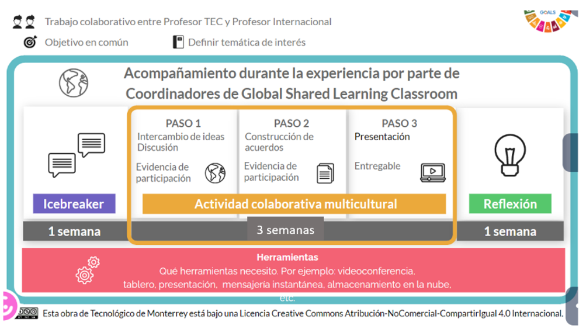
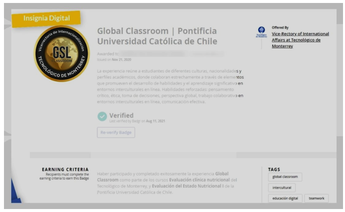

## 🧑‍🏭Project Method

The Above scenario will be collaboratively developed by both groups (ITA & TEC), where the TEC's professors are responsible for advise the the IoT environment (C2 dashboard, victim device, and other IoT infrastructure), and the ITA's professor will advise the network environment emulation.

The activity will be performed in 5 weeks, and the last one is the project workshop, which follows the [Global Sharing Learning Classroom Methodology-GSL](https://globalsharedlearning.tec.mx/en/gsl-classroom), as shown in the next Figure. Global Shared Learning Classroom or Global Classroom is an international experience from the Vice-Rectory for International Affairs at Tecnológico de Monterrey under the Global Shared Learning (GSL) initiative.

In this experience, a Tec de Monterrey course is linked with one or more courses from an international university, through an international element, using technological tools to connect students, foster collaboration and facilitate learning in intercultural environments. Through Global Classroom, 9,467 undergraduate students from 124 universities in 31 countries have been impacted.

### 📺What is Global Sharing Learning?

### 😎 The Method implementation

Following this methodology, the work will be implemented in 3 activities:  Icebreaker, Collaboration, and Reflection, as it is presented in the next figure.

The first element is the **Icebreaker**, which consists of an activity through which the participating students initiate the exchange and interaction with their classmates in an informal way to begin to generate a sense of confidence in communication and the use of technology applied. An icebreaker is an activity or game designed to welcome attendees and warm up the conversation among participants in a meeting, training class, team building session, or other activity. Any event that requires people to interact with each other comfortably and a facilitator is an opportunity to use an icebreaker.

The **Multicultural Collaborative Activity** is the main scenario of the model, and as its name indicates, it consists of at least one collaborative activity carried out in multicultural teams; that is, students from both institutions work together to meet a common goal. Teachers decide the type of activity to be carried out (project, case analysis, problem-solving, etc.), with the delivery of a final product (essay, report, video, presentation, etc.) mandatory.

The **reflection activity** is the final element, where participants have the opportunity to share their learning experience on the ground on the content learned about the differences and similarities found with their partners during the collaboration.

Tecnológico de Monterrey awards a **digital badge** to students who participate in the Global Classroom experience when they have met the following criteria:
- **Participation in the icebreaker.**
- **Participation in Team Activities.**
- **Participation in the Reflection.**
- **Obtain 80% of the total of the Global Classroom grade.**

In the end, students will receive an e-mail with their digital badge and another to answer a **Final Survey** that enables the students to evaluate their perceptions about the Global Classroom / COIL experience. It is important to cite that the **student's opinion is very valuable** to the GSL Coordinators. **The information will be handled with strict confidentiality** and aims to improve the Global Classroom continuously. 

Once you complete this activity, students will have finished this Global Classroom experience. In the following days, given they achieved the program's success, they will receive proof of participation.

**The detail of this activities and the schedule, you can see [HERE](DELIVERABLES.md).**

