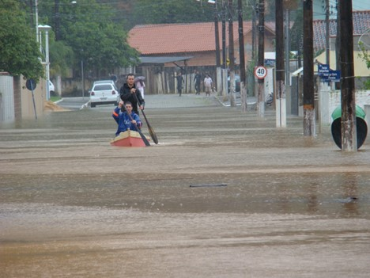
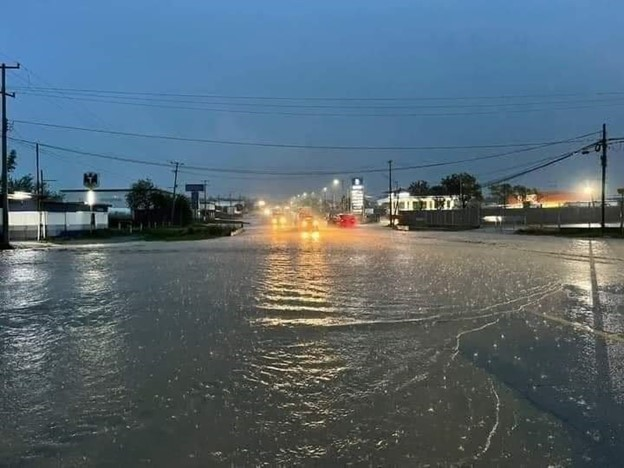
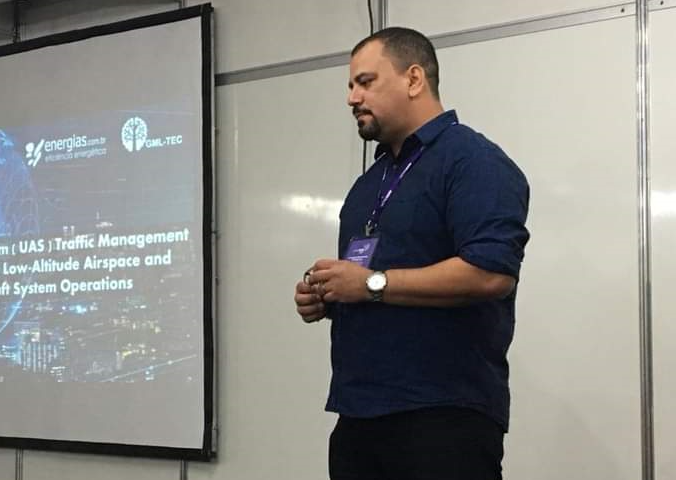
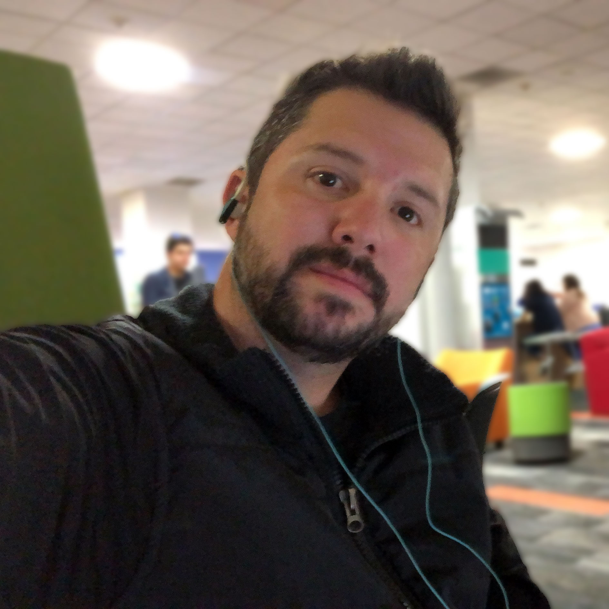
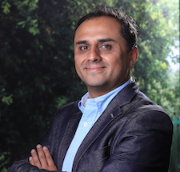
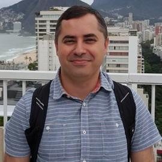
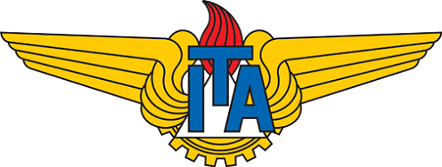

  

<h2 align="center">GSL Final Course - ITA & Tecnológico de Monterrey</h2>

## 📝 Table of Contents

- [About the Project](#about)
- [Scenario](#scenario_desc)
- [Solution](SOLUTION_DESCRIPTION.md)
- [Project Methodology](METHODOLOGY.md)
- [Deliverables](DELIVERABLES.md)
- [Schedule](#schedule)
- [License](#license)
- [Professors](#authors)
- [Student Groups](STUDENT.md)

## 🧐 About the Project 

The Internet of Things Implementation (TC1004B) is a course from [Tecnológico de Monterrey](https://www.tec.mx) based on the [TEC21 model](https://tec21connect.com/). It aims to introduce the main IoT foundations. For ten weeks, students design and implement a digital system prototype that can obtain data through sensors, process their information, and present them on an internet platform for later analysis and visualization. During the period, students will achieve the following skills:

- Elaboration and development of digital systems.
- Analysis, design, and development of databases.
- Resource management of a computer system through the efficient use of resources.
- Introduction to Interactive Design.
- Processes and project management.
- Analysis, design, and development of IoT systems.

The course has six modules: Digital Systems, Database Design and Analysis, Resource Management of a Computer System; Introduction to Interactive Design; Project Management and Processes, and Internet of Things.

This year the course will be performed inside the [Global Shared Learning Classroom]( https://global.tec.mx/en/global-shared-learning) program, an initiative of the Vice Rectory for International Affairs that promotes collaboration between students, professors, and international universities in a digital environment and with the use of technological tools. Global Shared Learning (GSL) is an opportunity to generate international experiences with meaningful learning.

The partner university is the [Instituto Tecnológico de Aeronáutica](http://www.ita.br/), which is a public university institution linked to the Air Force Command and is in São José dos Campos (São Paulo). ITA was created in 1950 and is considered a reference center in engineering education in Brazil. It was inspired by MIT (Massachusetts Institute of Technology) in the United States. It was the embryo of companies such as Embraer, IACIT, and Avibras, which developed aircraft, advanced defense, and air traffic systems for governments worldwide.

The collaboration focuses on developing the student’s sense of cooperation needed to solve a complex problem through a multicultural partnership. The implementation of GSL will happen in the implementation of the TC1004B “reto” project during the second part of the course (weeks 13 to 17). The selected scenario is a disaster situation (ex.: earthquake in Mexico and flooding in Brazil), a prevalent worldwide problem. In this scenario, you do not have telecommunication channels or any previous Command and Control (C2) system to provide rescue teams with essential communication (voice and data), planning, and execution services. Consequently, it is required to use the means existent in the community and by volunteers, for example, the use of drones to improve communication and support the identification of hazards.

The sustainable development goal is the “Industry, Innovation, and Infrastructure” and “Sustainable Cities and Communities,” where the group will work to build a resilient infrastructure when there is a natural hazard.

## 🏭 Scenario Description 

Every year, disasters and crises devastate people, communities, and entire societies worldwide. Worryingly, they are predicted to become more common in the future. Disasters can occur naturally (e.g., tornadoes, hurricanes, earthquakes, floods, wildfires, mudslides, or drought) or be human-caused (e.g., mass shootings, chemical spills, or terrorist attacks). Preparing for, responding to, and recovering from disasters and traumatic events is essential to individuals’ and communities' behavioral health.

When people experience a disaster, they may experience a variety of reactions, many of which are natural responses to challenging situations. Most people show resilience after a disaster. Resilience is the ability to bounce back, cope with adversity, and endure demanding conditions. Thankfully, resilience in disaster recovery is ordinary, not extraordinary, and people regularly demonstrate this ability. Supportive resources to address stress and other hardships are a critical component of resilience.

Like war, disasters are also much unstructured in scope. No one can predict the exact time and how a disaster will strike. Sometimes the local infrastructure is devasted, and there are no telecommunication resources available to provide the essential communication necessities, for example, providing means to the affected communities asking for help. Usually, [this type of situation requires a complete telecommunication infrastructure to provide Command and Control](https://www.tandfonline.com/doi/abs/10.1080/19393550903551843) to support the operations.

We use a flooding scenario to support the course in the project development. Because the changes to our climate and environment are already contributing to the increased frequency, intensity, and unpredictability of severe weather events, what makes this type of disaster usually in tropical countries like [Brazil](https://www.theguardian.com/world/2022/may/31/dozens-dead-in-brazil-floods-and-landslides-with-many-more-missing) and [Mexico](https://mexiconewsdaily.com/news/from-drought-to-floods-heavy-rains-continue-across-the-country/), generating many victims and causing fatalities and incalculable losses (financial and social) for the population.

<table>
<tr>
<th> </a> Itajaí (BR) </th>
<th> Monterrey (MEX)</a>  </th>
</tr>
</table>

For example, in November of 2008, Santa Catarina, a state in the south of Brazil, had a period of heavy rainfall (20-23 November). The state had suffered constant rains for over two months, which turned the soil wet enough to cause a landslide during the storm that hit the state in late November. Around 60 towns and over 1.5 million people were affected. At least 128 people have been killed, with over 78,700 forced to evacuate their homes. A further 150,000 have been left without electricity, while water rationing is being carried out in at least one town due to purification problems. Several regions’ cities have become cut off due to floodwater and landslide debris. Water levels in the Vale do Itajaí have risen to eleven meters above normal.

Because of the electrical blackout, many communities were left without communication, which made it difficult for people to call for help and inform where they were. It is the issue that our project will try to solve.

## ⏲️⏲️ Schedule 

<table style="border-collapse: collapse; width: 100%">
      <tr>
        <th colspan="3" style="border: 1px solid #dddddd; padding: 8px;">Project Schedule</th>
      </tr>
      <tr>
        <td colspan="2" style="border: 1px solid #dddddd; text-align: left; padding: 8px;">Opening Class</td>
        <td style="border: 1px solid #dddddd; text-align: left; padding: 8px;">1st Nov 2022 19:00 (GMT-5)</td>
      </tr>
      <tr>
        <td rowspan="2" style="border: 1px solid #dddddd; text-align: left; padding: 8px;">Icebreaker</td>
        <td style="border: 1px solid #dddddd; text-align: left; padding: 8px;">Step 1 - Icebreaker Video</td>
        <td style="border: 1px solid #dddddd; text-align: left; padding: 8px;">3 Nov 2022 23:59 (GMT-5)</td>
      </tr>
      <tr>
        <td style="border: 1px solid #dddddd; text-align: left; padding: 8px;">Step 2 - Reply to the peers</td>
        <td style="border: 1px solid #dddddd; text-align: left; padding: 8px;">4 Nov 2022 23:59 (GMT-5)</td>
      </tr>
      <tr>
        <td rowspan="4" style="border: 1px solid #dddddd; text-align: left; padding: 8px;">Collaboration</td>
        <td style="border: 1px solid #dddddd; text-align: left; padding: 8px;">Step 1 – Project Setup</td>
        <td style="border: 1px solid #dddddd; text-align: left; padding: 8px;">11 Nov 2022 23:59 (GMT-5)</td>
      </tr>
      <tr>
        <td style="border: 1px solid #dddddd; text-align: left; padding: 8px;">Step 2 – Client & Edge Stage</td>
        <td style="border: 1px solid #dddddd; text-align: left; padding: 8px;">18 Nov 2022 23:59 (GMT-5)</td>
      </tr>
      <tr>
        <td style="border: 1px solid #dddddd; text-align: left; padding: 8px;">Step 3 – Cloud Stage</td>
        <td style="border: 1px solid #dddddd; text-align: left; padding: 8px;">25 Nov 2022 23:59 (GMT-5)</td>
      </tr>
      <tr>
        <td style="border: 1px solid #dddddd; text-align: left; padding: 8px;">Step 4 – Final Presentation</td>
        <td style="border: 1px solid #dddddd; text-align: left; padding: 8px;">2 Dec 2022 23:59 (GMT-5)</td>
      </tr>
      <tr>
        <td colspan="2" style="border: 1px solid #dddddd; text-align: left; padding: 8px;">Reflection</td>
        <td style="border: 1px solid #dddddd; text-align: left; padding: 8px;">3 Dec 2022 23:59 (GMT-5)</td>
      </tr>
    </table>

## :memo: License 

This project is under the GPL license. Veja o arquivo [LICENSE](LICENSE) para mais detalhes.

## ✍️ Professors 
<table>
<tr>
  <th>  </th>
  <th> <a href="https://github.com/kabartsjc" rel="noopener">Alexandre Barreto [@kabartsjc]</a> </th>
  <th>  </th>
</tr>

<tr>
  <th>  </th>
  <th> <a href="https://github.com/luisjglz" rel="noopener">Luis José González [@luisjglz]</a> </th>
  <th>  </th>
</tr>

<tr>
  <th>  </th>
  <th> <a href="https://www.researchgate.net/profile/Luis-Yepez-Perez" rel="noopener">Luis Yépez Pérez</a> </th>
  <th>  </th>
</tr>

<tr>
  <th>  </th>
  <th> <a href="https://github.com/cmarcond" rel="noopener">Cesar A. C. Marcondes [@cmarcond]</a> </th>
  <th>  </th>
</tr>
</table>
